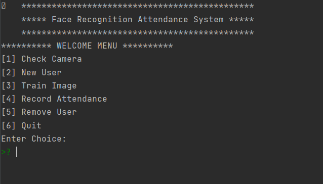

## **Face Recognition Biometric System**

_This is the user Interface_:

_Features:_
* Robust in anti-cheating measures
* **99.4% Accuracy** in detection.
* Attendance with Time is stored into the database.
* Very Accurate in Different Light Conditions especially low-light
* Searches if the newly registering user already exists in the database or
if his name or id are already present in the system.
* Ability to Safely remove a user from the system

_Algorithm_:
* Uses Dlib's Histogram of Oriented Gradients Technique for Face Detection and Orientation
* Uses FaceNet (Deep Learning Model) for Face Identification
* Uses SVM Classifier to query database rapidly (to match face)
* Eye Blink Detection for anti face-cheating

_Implementation_:
* Used Python Language
* OpenCV, dlib, face_recogntion Libraries

_This code is deployment ready upon slight few changes_

*Future Work*

* Will add a Database and confidence score system if possible

